# Nama Kelompok
Samiaji Santoso
Nurdian
Muhammad Haris

# KONFIGURASI TCP/IP

## Konfigurasi IP Address Server

1. Silahkan kalian buka aplikasi VirtualBox kalian lalu jalankan server debian yang telah di install. Masukkan username dan password untuk login ke dalam system. Setelah itu silahkan kalian masuk ke system root pada server debian tersebut dengan cara mengetikkan perintah su lalu enter dan masukkan kembali password root server kalian.

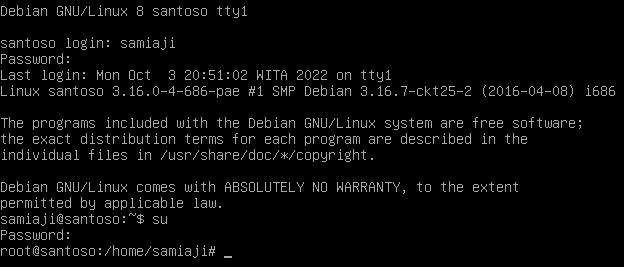

2. Sekarang kita akan mengecek interface apa saja yang aktif pada system operasi debian tersebut dengan cara mengetikkan perintah ifconfig

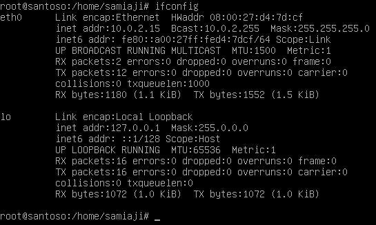

3. Mungkin ada beberapa computer kalian yang tidak terdapat eth0 atau eth yang terdapat pada computer kalian belum diaktifkan. Untuk mengaktifkannya silahkan ketikkan dengan perintah ifup eth0 dan untuk menonaktifkannya dengan menggunakan perintah ifdown eth0. Lalu ketikkan kembali perintah ifconfig untuk melihatnya.

4. Pada gambar diatas kita bisa lihat bahwa IP address tersebut menggunakan alamat dengan IP 10.0.2.15. Kita akan membuat IP server kita menjadi 192.168.1.1 sehingga kita akan mengubah IP address tersebut. Untuk mengubahnya silahkan kalian ketikkan dengan perintah nano/etc/network/interfaces. Maka akan muncul pengaturan IP seperti gambar dibawah ini.

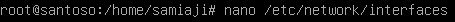

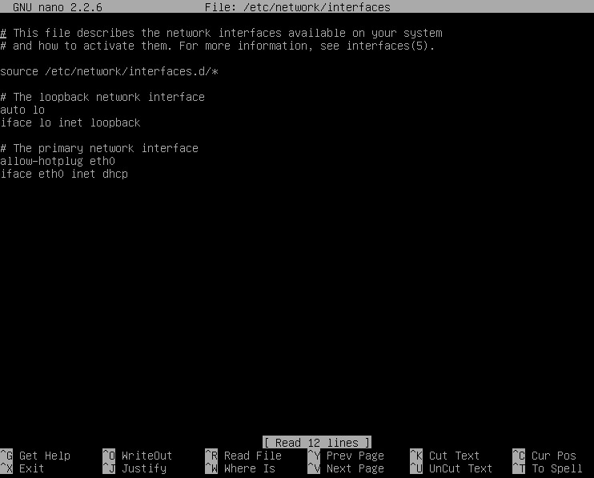

5. Pada gambar diatas menunjukkan pengaturan jaringan menggunakan DHCP, maka dari itu kita akan buat jaringan tersebut menjadi static. Silahkan kalian ubah menjadi script diatas seperti pada gambar dibawah ini

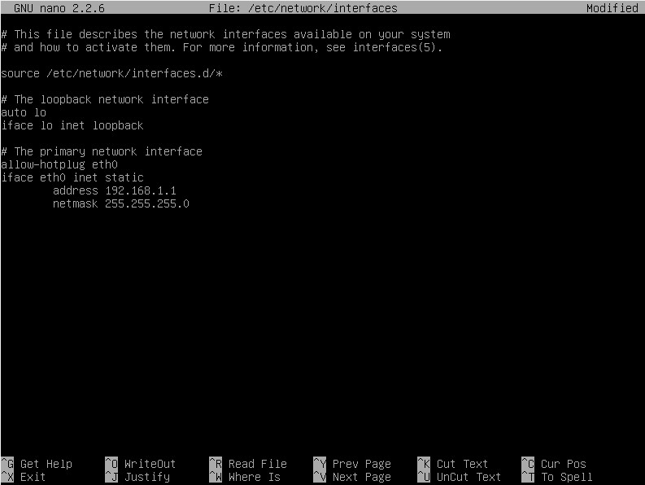

6. Setelah itu untuk keluar dari editor nano tersebut dengan cara menekan CTRL + X dan Y enter. Sekarang kita perlu merestartnya dengan cara mengetikkan perintah service networking restart, lalu kalian lihat kembali IP addressnya dengan mengetikkan perintah ifconfig. Jika IP address belum berubah maka kalian bisa mengetikkan perintah /etc/init.d/networking restart setelah itu ketikkan kembali perintah ifconfig maka IP address pada server kita berhasil diubah.

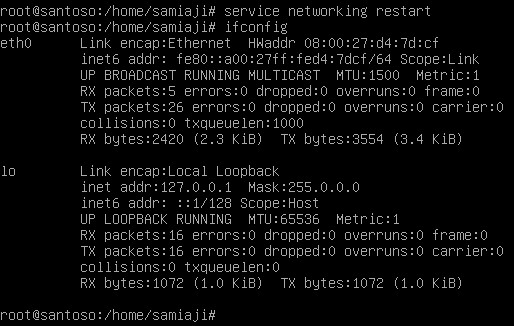

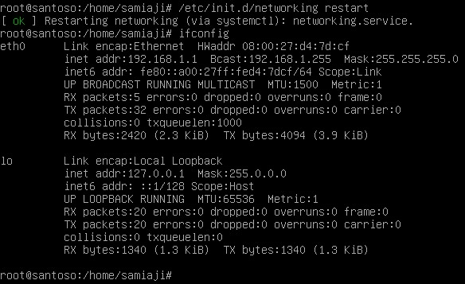

## Konfigurasi IP Address Client

1. Silahkan buka cmd (Command Prompt) pada computer real/computer client kalian. Setelah itu ketikkan perintah ipconfig maka akan muncul alamat IP yang kita gunakan.

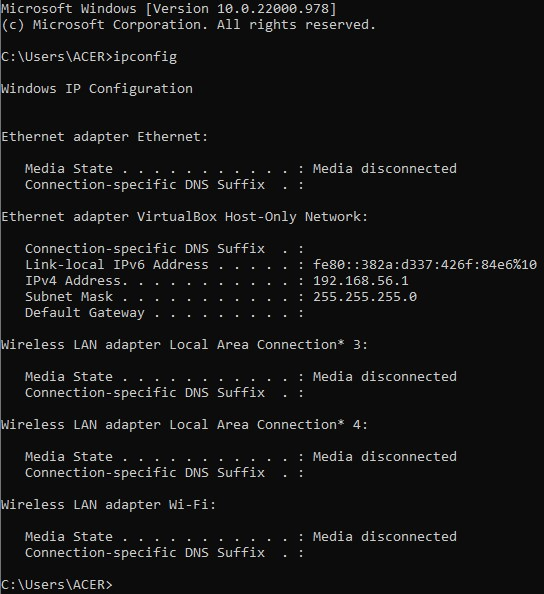

2. Pada gambar diatas menunjukkan bahwa IP address client computer yaitu 192.168.56.1, IP tersebut tidak sesuai dengan IP yang kita inginkan yaitu 192.168.1.10. Maka dari itu kita mengubahnya terlebih dahulu, buka control panel > Network and Internet > Network and Sharing Center > Network Connection, lalu pilih change adapter settings pada sebelah kiri tab. Dan kita akan melihat beberapa network yang bisa digunakan. Pada jaringan ini karena kita menggunakan host only adapter maka kita akan mengubah pada alamat IP tersebut.

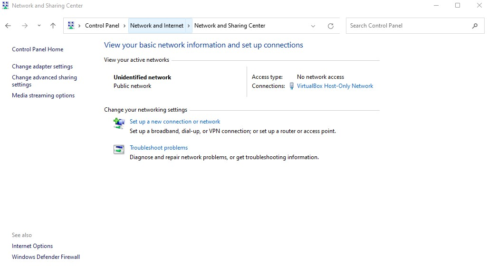

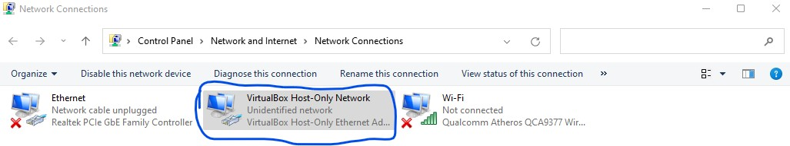

3. Selanjutnya klik 2x pada bagian yang ditandai dengan warna biru, lalu pilih properties dan pilih Internet Protocol Version 4 (TCP/IPv4) dan ubah alamat IP seperti gambar dibawah ini.

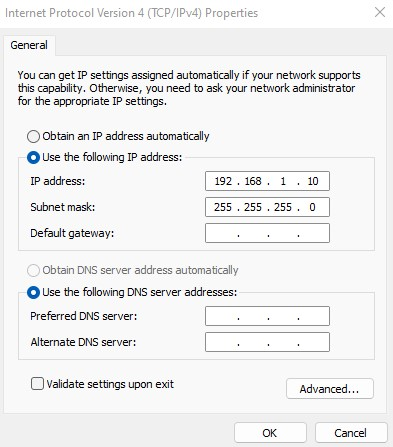

4. Sekarang cek kembali pada CMD dan ketikkan perintah ipconfig

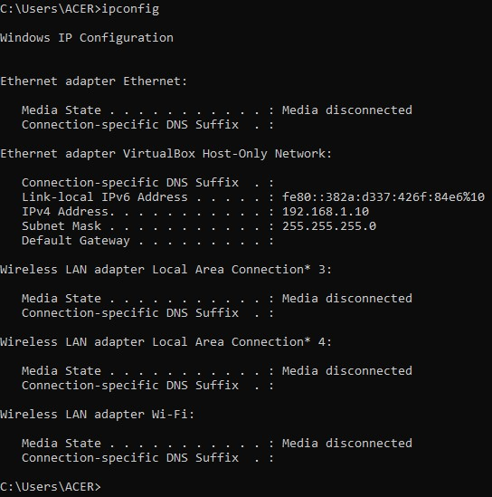

5. Sekarang kita akan menguji koneksi dari client ke server dengan cara ketikkan perintah ping 192.168.1.1. Dan kita lihat hasilnya seperti pada gambar dibawah ini.

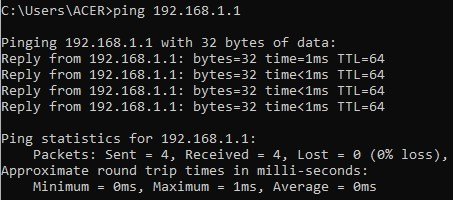
